title: Campus Open Data / Open API
output: index.html

--

<h1 style="font-size: 72px">
  被討厭的勇氣 
  校園開放資料的攻防戰
</h1>
 

## Denny Huang

--

### Who am I ?

 
 
<h2 style="font-size: 60px">
  <b>Denny Huang</b>
</h2>

--

 

   
  <a href="http://sitcon.org/">http://sitcon.org</a>

* Founder and Chief Coordinator of SITCON 2013, 2014

--

 
 
 
<h2 style="font-size: 60px">
  <b>http://denny.one/</b>
</h2>

--

  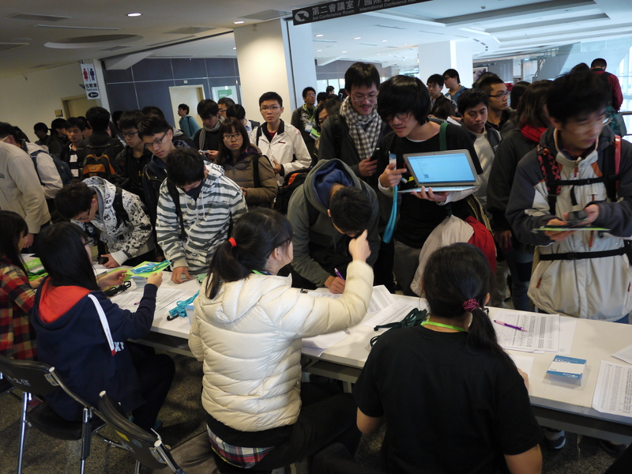

--

  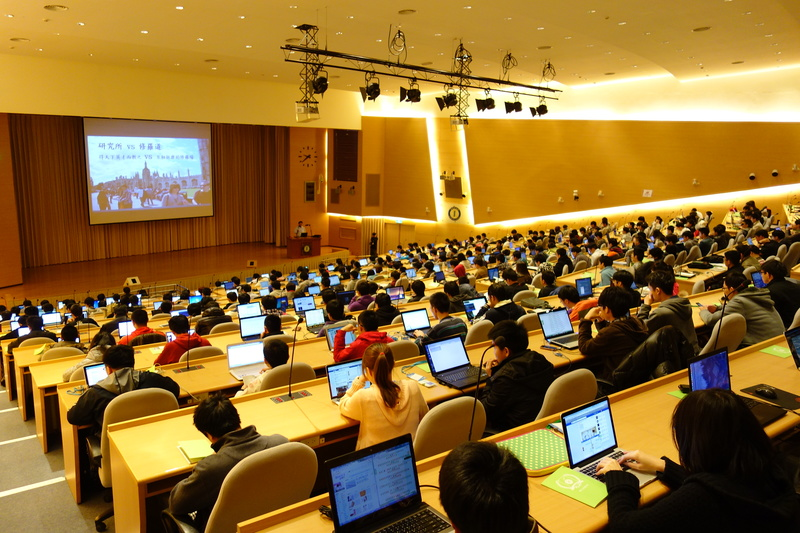

--

 
 

  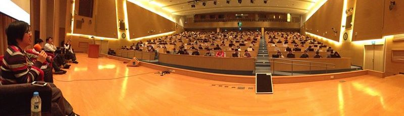

--

 
 

  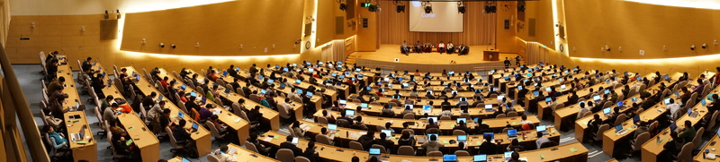

--

  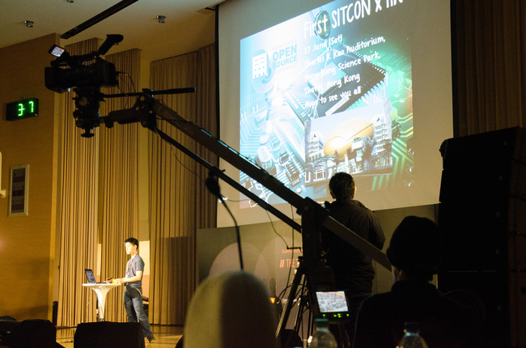

--

  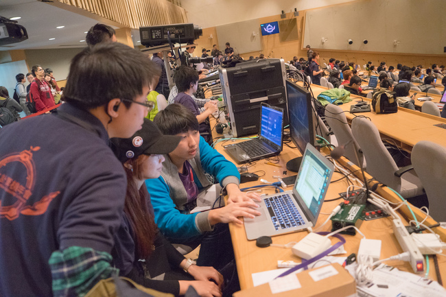

--

  

--

  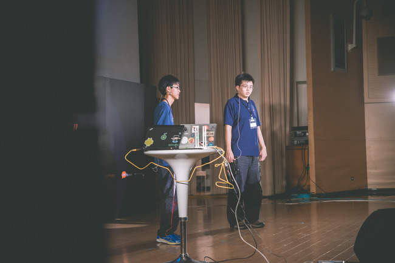

--

# Workshop

--

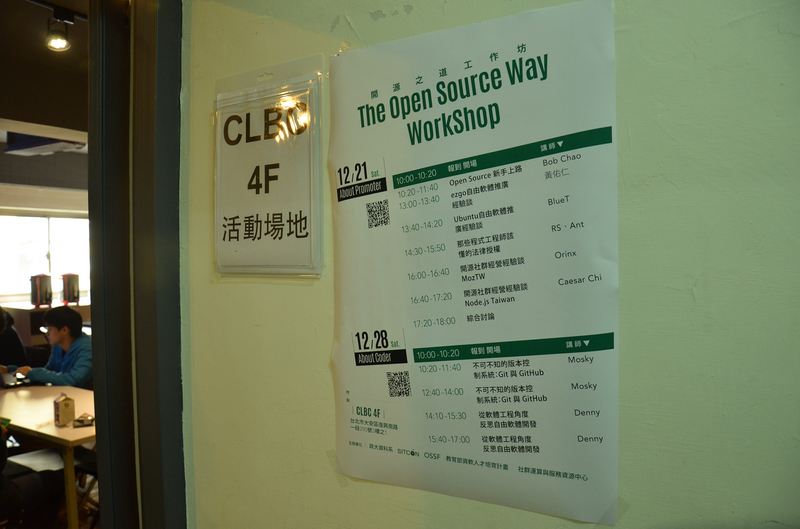

--

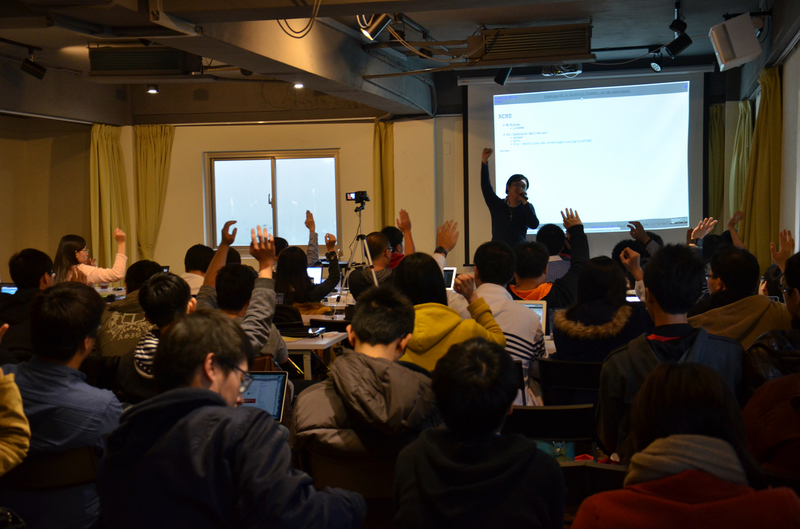

--

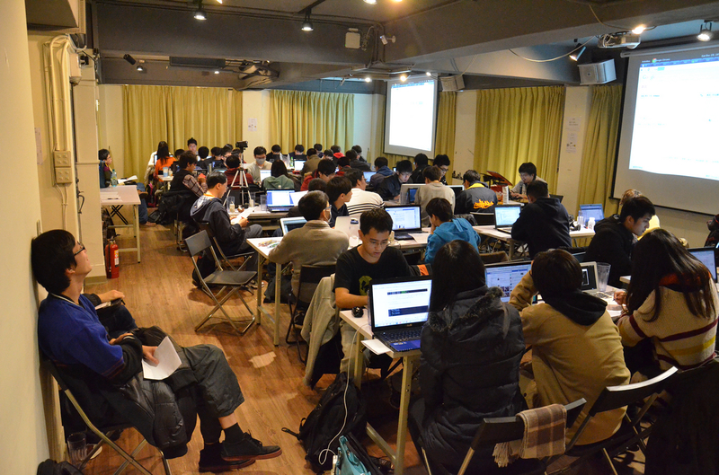

--

  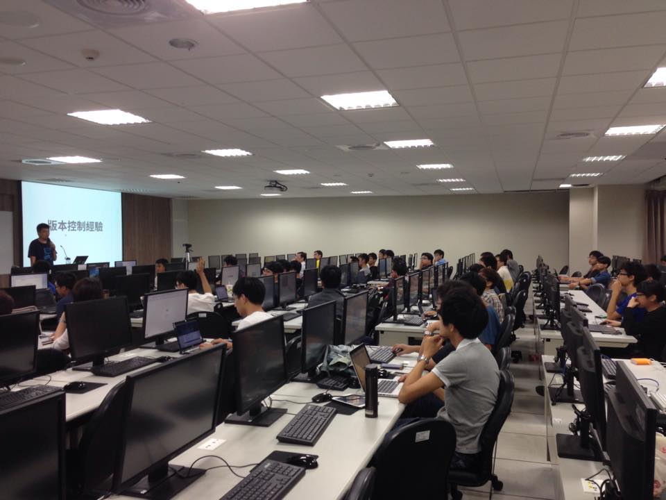

--

  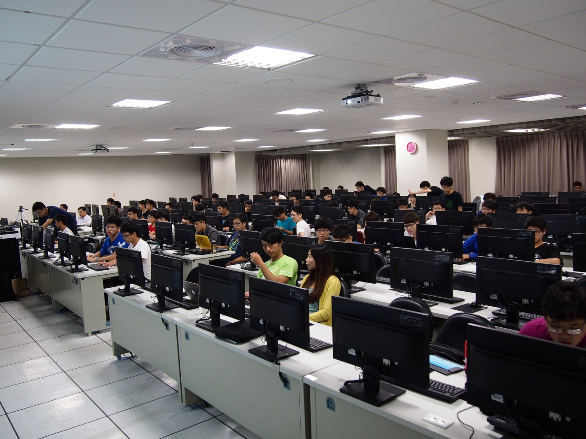

--

# Summer Camp

--

  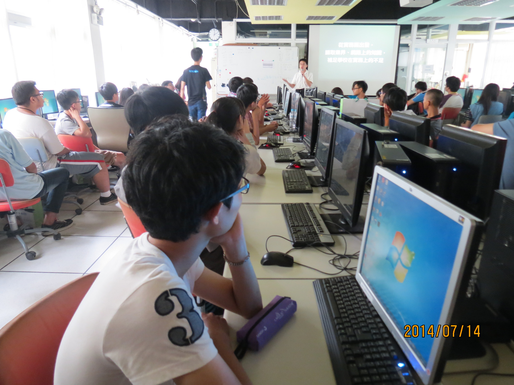

--

  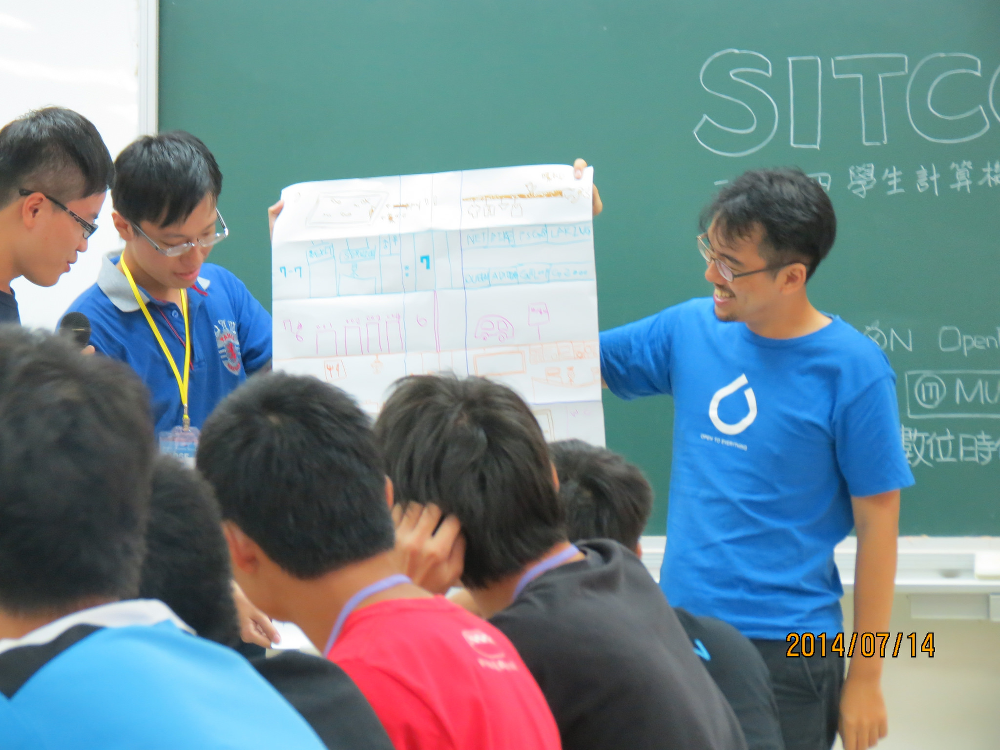

--

  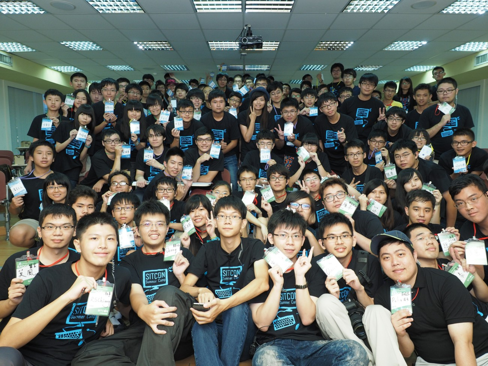

--

  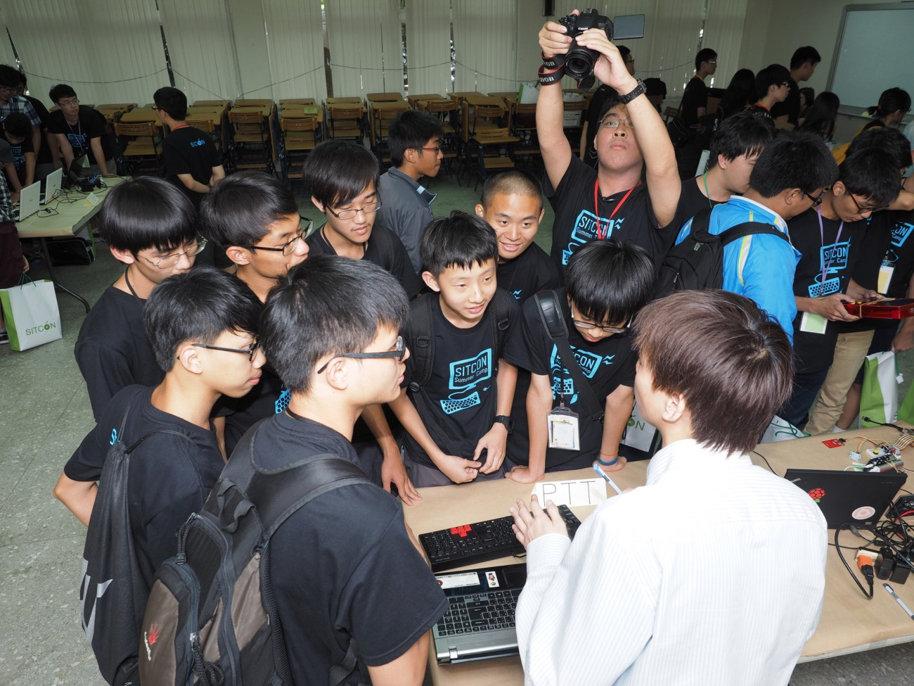

--

  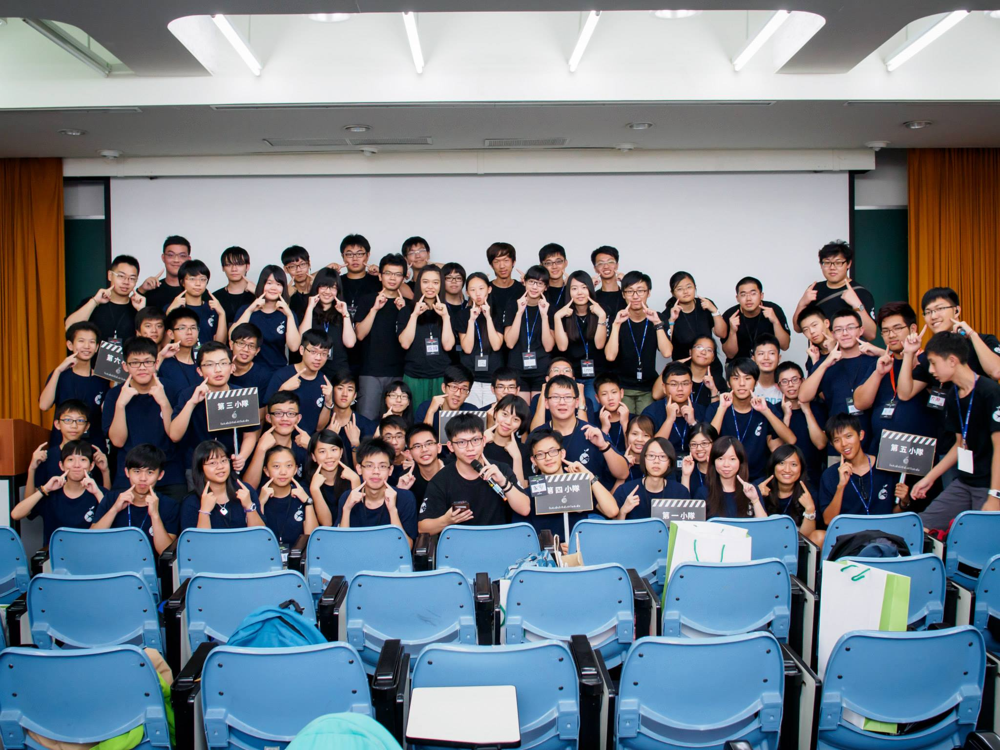

--

### Meetup
* Taipei
* Taoyuan
* Hsinchu
* Taichung
* Yunlin
* Tainan
* Kaohsiung
* Hualien
* Taitung

--

<h1>
  
</h1>
## http://hackgen.sitcon.org/

--

  

--

  

--

  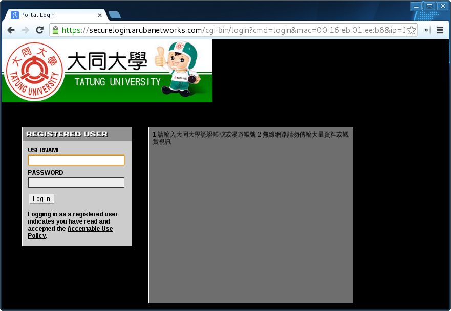

--

  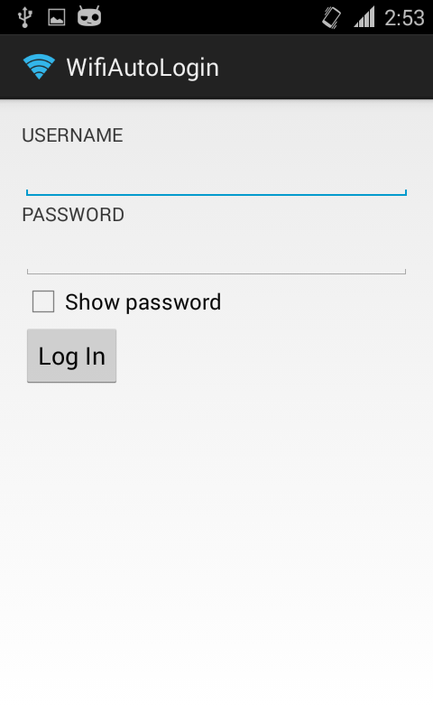

--

  

--

  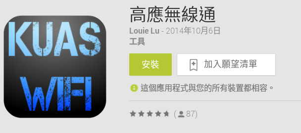

--

  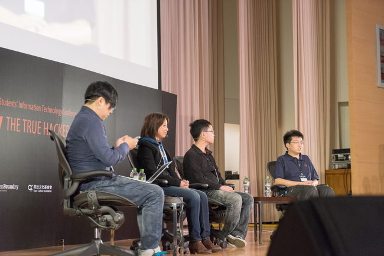

--

# Open Campus

--

 
 
 
<h2 style="font-size: 40px">
  <b>Students&#39; Participation in School Systems Development</b>
</h2>

--

 
 
 
<h2 style="font-size: 40px">
  <b>Campus Information System</b>
</h2>

--

# Problem?

--

# UI/UX

--

# Old-Fashion Technology

--

# Security

--

# IE Only

--

# But

--

### Open source solution

  

--

### Commercial solution

* [Power School](http://www.powerschool.com/)

--

# Overview

--

# NCTU

--

# NCU
## http://ncu-cc.github.io/

--

# PCCU
## http://mobi.pccu.edu.tw/DataAPI/Help

--

# Git
## Get my latest git slide on [my talks page](http://denny.one/talks/).

--

# Helpful skill
## `git reflog`

--

# Tricky skill
## http://denny.one/TDOH-git-awesome/#24

--

### Reference

* Allen Chou - 淺談台灣學校的校務系統問題與實戰經歷

--

<h1 style="font-size: 72px">
  Thanks for listening!
</h1>

   

  

<h2 style="font-size: 18px">
本投影片採用<a href="http://creativecommons.org/licenses/by-sa/3.0/tw/" target="_blank">創用 CC「姓名標示—相同方式分享 3.0 台灣」授權條款</a>
</h2>

